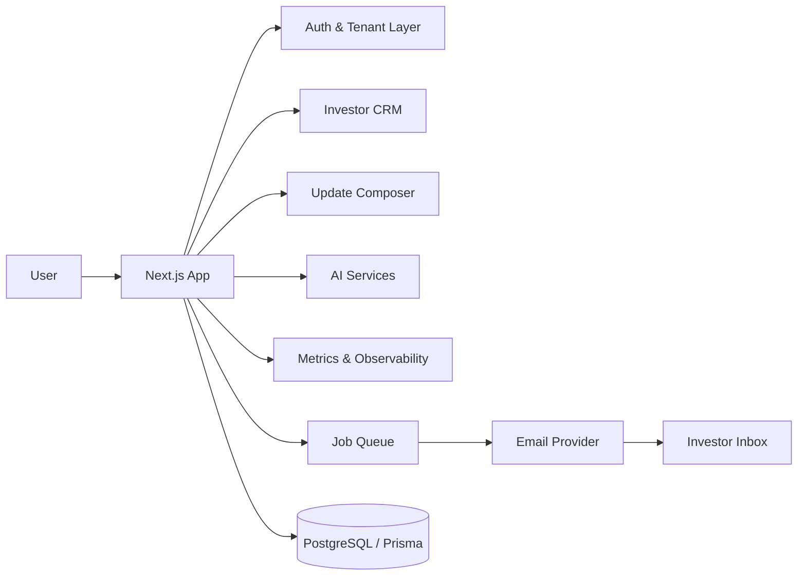

# Architecture Diagram

```mermaid
flowchart LR
  U[User] --> N[Next.js App]
  N --> A[Auth & Tenant Layer]
  N --> C[Investor CRM]
  N --> D[Update Composer]
  N --> I[AI Services]
  N --> M[Metrics & Observability]
  N --> J[Job Queue]
  J --> E[Email Provider]
  N --> P[(PostgreSQL / Prisma)]
  E --> T[Investor Inbox]
```

## Layers

- Presentation
- Domain
- API
- Integrations
- Persistence
- Operations
